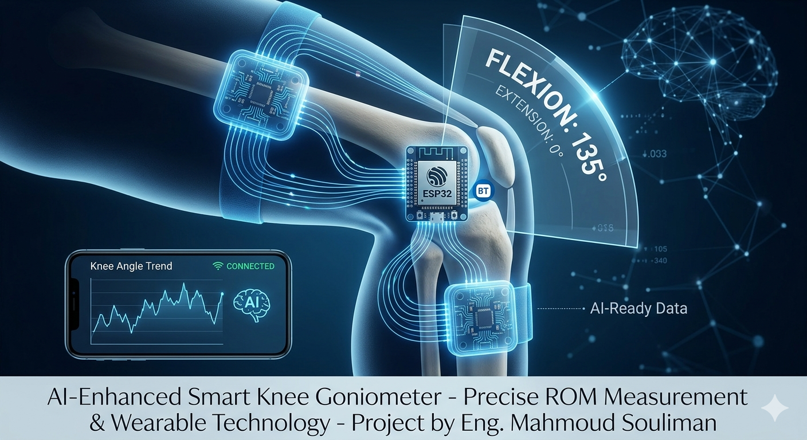

# Smart-Knee-Goniometer-Android-ESP32
A medical-grade real-time knee angle monitoring system using dual MPU6050 sensors, ESP32, and a custom Java Android application for biomechanical rehabilitation
# Smart Knee Goniometer - Real-time Biomechanical Monitor
**Lead Engineer: Mahmoud Souliman**

## 📌 Project Overview
The **Smart Knee Goniometer** is a specialized medical engineering solution designed to measure and visualize the Range of Motion (ROM) of the knee joint in real-time. By integrating wearable sensors with a custom Android interface, it provides clinicians and patients with immediate bio-feedback for physical therapy and post-operative rehabilitation.

## 🛠 Engineering Architecture

### 1. Hardware & Firmware (ESP32)
* **Dual-Sensor Fusion:** Uses two MPU6050 (IMU) sensors to calculate the relative angle between the thigh and the shin.
* **I2C Protocol:** Implements dual-addressing (0x68 and 0x69) to communicate with both sensors over a single bus.
* **Drift Compensation:** Dynamic calibration via the `calcOffsets()` method to ensure high angular precision.

### 2. Mobile Application (Android Java)
* **Robust Connection Strategy:** Solved Bluetooth connectivity issues using a hybrid approach (Standard RFCOMM + Reflection Fallback) to ensure 99% connection stability.
* **Real-time Rendering:** Features a custom-built `KneeView` that uses vector mathematics to render joint movement with zero lag.
* **Data Integrity:** Implemented an asynchronous listener with a dedicated buffer to handle high-frequency data streams without freezing the UI.
* 

  

## 🚀 Key Challenges Solved
* **The "Bluetooth Lock" Issue:** Fixed the common Android Bluetooth socket failure by implementing a 1000ms hardware handshake delay and a socket cleanup routine.
* **Sensor Synchronization:** Developed a logic to synchronize two independent IMUs to provide a single, accurate knee angle regardless of the body's orientation in space.

## 📁 Repository Structure
* **/Firmware**: ESP32 Arduino source code (.ino).
* **/AndroidApp**: Core Java classes, XML layouts, and Android Manifest.
* **/Hardware**: Wiring diagrams and sensor configuration.

## ⚙️ How to Run
1.  **Hardware**: Connect two MPU6050 sensors to the ESP32 (SDA: 21, SCL: 22). Connect AD0 of the second sensor to 3.3V.
2.  **Firmware**: Flash the `.ino` file using Arduino IDE.
3.  **App**: Build the Android project and install the APK. Pair the device via System Settings before launching the app.

---
**Developed for professional portfolio purposes.**
*Copyright © 2026 Mahmoud Souliman. All rights reserved.*
